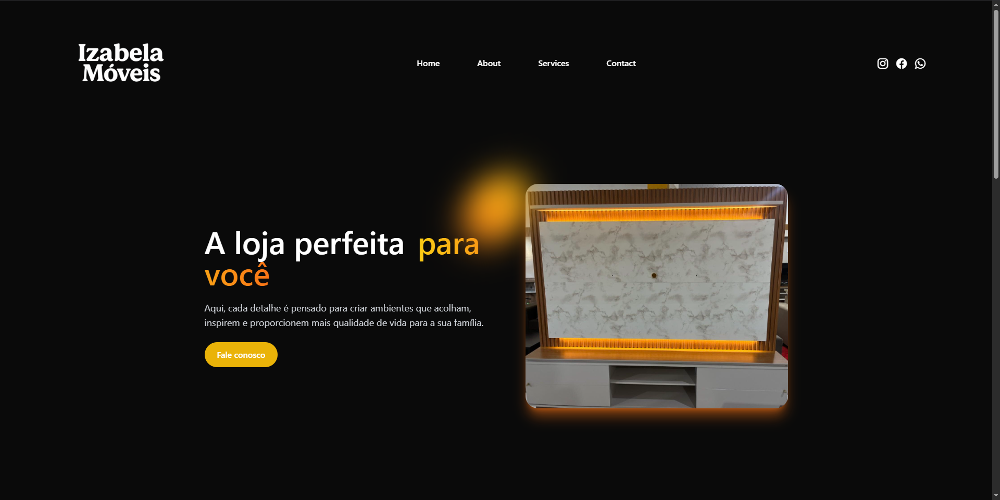

# 🪑 Izabela Móveis

Site institucional moderno e responsivo desenvolvido para a loja **Izabela Móveis**, com foco em **experiência do usuário**, **animações suaves** e **carrossel interativo**.


## 🔍 Sobre o Projeto

Este projeto tem como objetivo apresentar os produtos e valores da loja Izabela Móveis de forma elegante e acessível em diversos dispositivos. A interface foi criada com atenção à estética, usabilidade e performance.

## 🚀 Tecnologias Utilizadas

- [HTML5](https://developer.mozilla.org/pt-BR/docs/Web/HTML)
- [Tailwind CSS](https://tailwindcss.com/)
- [JavaScript](https://developer.mozilla.org/pt-BR/docs/Web/JavaScript)
- [AOS - Animate On Scroll](https://michalsnik.github.io/aos/)
- [Bootstrap Icons](https://icons.getbootstrap.com/)

## 🧭 Funcionalidades

- Design responsivo para mobile, tablet e desktop
- Animações de entrada com AOS
- Carrossel de imagens com transição suave
- Menu mobile com animação de abertura
- Destaques com ícones e efeitos visuais
- Link para redes sociais (Instagram, Facebook e WhatsApp)

## 📦 Estrutura do Projeto

```
📁 izabela-moveis/
├── index.html         # Página principal
├── style.css          # Estilos customizados
├── index.js           # Scripts interativos (menu, carrossel, AOS)
├── assets/            # Imagens e logo da loja
└── README.md          # Documentação do projeto
```

## 📸 Captura de Tela



## 🛠️ Como usar

1. Clone este repositório:
   ```bash
   git clone https://github.com/seu-usuario/izabela-moveis.git
   ```
2. Navegue até a pasta do projeto:
   ```bash
   cd izabela-moveis
   ```
3. Abra o `index.html` em seu navegador ou use o Live Server no VS Code.

## 🔗 Links Úteis

- Instagram: [@izabelamoveis1](https://www.instagram.com/izabelamoveis1/)
- Facebook: [Izabela Móveis](https://www.facebook.com/izabela.movies)
- WhatsApp: [Clique para conversar](https://wa.me/5544988239500)

## 🙌 Créditos

Desenvolvido por Rafael Rodrigues Oliveira Santos como parte do portfólio pessoal de projetos em **desenvolvimento web**.

---

📬 Se tiver sugestões de melhorias, integração com e-commerce ou adicionar um formulário funcional, entre em contato!

